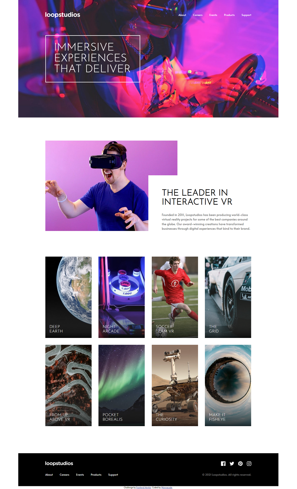
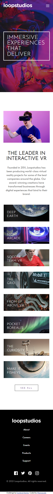
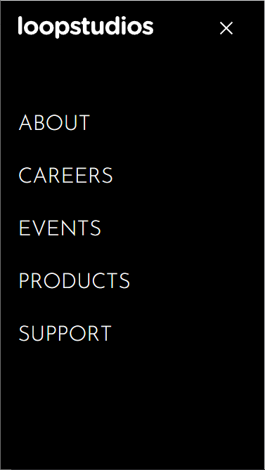

# Frontend Mentor - Loopstudios landing page solution

This is a solution to the [Loopstudios landing page challenge on Frontend Mentor](https://www.frontendmentor.io/challenges/loopstudios-landing-page-N88J5Onjw). Frontend Mentor challenges help you improve your coding skills by building realistic projects. 

## Table of contents

- [Overview](#overview)
  - [The challenge](#the-challenge)
  - [Screenshot](#screenshot)
  - [Links](#links)
- [My process](#my-process)
  - [Built with](#built-with)
  - [What I learned](#what-i-learned)
  - [Continued development](#continued-development)
  - [Useful resources](#useful-resources)
- [Author](#author)
- [Acknowledgments](#acknowledgments)

**Note: Delete this note and update the table of contents based on what sections you keep.**

## Overview

This challenge builds upon a previous challenge which was the Intro Section with Dropdown Navigation.

### The challenge

Users should be able to:

- View the optimal layout for the site depending on their device's screen size
- See hover states for all interactive elements on the page

### Screenshot






### Links

- Solution URL: [Solution URL here](https://github.com/kwngptrl/FEM-loopstudios-landing-page-main)
- Live Site URL: [Add live site URL here](https://your-live-site-url.com)

## My process

I wanted to start using a toolchain for this project, but I still need to read a bit more about that.

The design seems like a straight up grid layout implementation with the exception of the middle section, where a block of text overlaps an image. One may wonder why the content is centered in between white bars (if your monitor resolution is greater than 1440 pixels), well, that's because the desktop design only goes up to 1440 pixels, and so I decided to just center it.

A lot of the underlying code was reused from a previous Frontend Mentor challenges, namely the [Intro Section with Dropdown Navigation](https://github.com/kwngptrl/FEM-intro-section-with-dropdown-navigation-main). I just made some changes based on what I assume the design was to be, like in mobile mode, when the hamburger menu is clicked the menu drops down instead of sliding from the right. Therefore the logo and the 'x' close button will continue to be shown.

### Built with

- Semantic HTML5 markup
- CSS custom properties
- Flexbox
- CSS Grid
- Mobile-first workflow
- Vanilla JS

### What I learned
For the hero image and the navigation bar, as well as the the image tile and the text inside each, I used what I learned from [Less Absolute Positioning With Modern CSS](https://ishadeed.com/article/less-absolute-positioning-modern-css/).

The section with many multiple images was made with the pattern: (which allowed for responsiveness with few lines of code)
```css
display: grid;
grid-template-columns: repeat(auto-fit, minmax(225px, 1fr));
gap: 2.5rem;
```

The corresponding HTML I came up with after wracking my head a bit: (This allowed for auto switching from desktop to mobile mode).
```html
<a href="#">
  <figure>
    <picture>
      <source media="(min-width: 768px)" srcset="./images/desktop/image-fisheye.jpg">
      
    </picture>
    <figcaption class="title">Make it fisheye</figcaption>
  </figure>
</a>
```
A neat trick I learned is the linear-gradient overlay which switches from vertical to horizontal (as the viewport is resized) by using a css variable...
```css
inset: 0 10% 0 0;
--direction: 270deg;
```
...and later on...
```css
inset: 30% 0 0 0;
--direction: 180deg;
```
... without reusing the very long `background-image: linear-gradient...` definition twice. I also wish I could switch it when `direction: rtl;` But I haven't figured it out yet. It might be like using a data attribute.

I will admit I borrowed some code from YouTuber Coding Habit [Underline nav menu link hover effect using html & css](https://www.youtube.com/watch?v=gGySLNda00s). However, I noticed that when I slowly move the mouse cursor from the bottom of each nav menu item, the animated line would appear, then it would disappear, and then reappear again when it enters the text. The cursor enters `<a>` ➜ `<li>` ➜ `<a>` as seen via devtools. This doesn't occur with the social media links where it just goes from `<a>` ➜ ``, since the `` tag is enclosed by the `<a>` tag there is no shift. I'm still wondering of a proper solution so it wouldn't happen.

For the mobile hamburger menu, I modified the existing code so that the menu items would drop down from the top while preserving the logo and the 'x' icon. However, using `translate()` would briefly cover the logo and the 'x' icon as it drops down, and then reveal them again when it finishes the transform. It wasn't respecting the z-index. I found a workaround using `scaleY()` from Dave Gray's tutorial on YouTube: [ How to Make a Responsive Navbar Dropdown Menu and Website with HTML CSS and Vanilla Javascript ](https://www.youtube.com/watch?v=94MTi38w9Vo). The only thing to add is `transform-origin: top center;` to make it drop from the top.

The `.dark-overlay` was changed to all black, because on the desktop it leaves a gray rectangular area at the upper right corner. But everything's fine on an actual mobile device and in the dev tools mobile emulator.

In the footer section, the social media link images were resized based on an article I read: [A Deep Dive Into object-fit And background-size In CSS](https://www.smashingmagazine.com/2021/10/object-fit-background-size-css/). And also because if I didn't do that, the animated underline is not going to work properly (it shifts up at the twitter logo).

### Continued development

There is one thing that I couldn't solve for now. When in Firefox with the dev tools open, I get overflow warnings. Perhaps, it's my use of clamp for certain things, the overflow involves the images but sometimes even text. For the images, it should've been taken care of by in the reset.css...
```css
img,
picture,
video,
canvas,
svg {
    max-width: 100%;
    display: block; 
}
```

So to experiment, I decided to comment out the part in the HTML where it loads the CSS stylesheet...
```html
<!--<link rel="stylesheet" href="style.css">-->
```

...and it still shows `overflow` in Firefox! For the javascript code, there was not much to do except to comment out some lines where a certain feature was not being used.

### Useful resources

I have already provided the links above for some things which I found useful, and might reuse in the future.

## Author

- Frontend Mentor - [@Wannacode](https://www.frontendmentor.io/profile/kwngptrl)

## Acknowledgments

All acknowledgments are stated above, and with links for those who want to research them.
